# AuthGuard AI

**A human-governed, multi-agent prior-authorization decision-support command center built with Python, Streamlit, Flask, XGBoost, deterministic expert rules, local policy RAG, JSON memory, optional Groq/Gemini explanations, visible processing lights, debate-based reasoning, and mandatory human review where risk or policy requires it.**

> **Portfolio and educational prototype only.** AuthGuard does not determine coverage, provide medical advice, submit requests, or replace qualified utilization-management, clinical, privacy, compliance, or payer-policy review. Use synthetic data or properly authorized, de-identified records only.

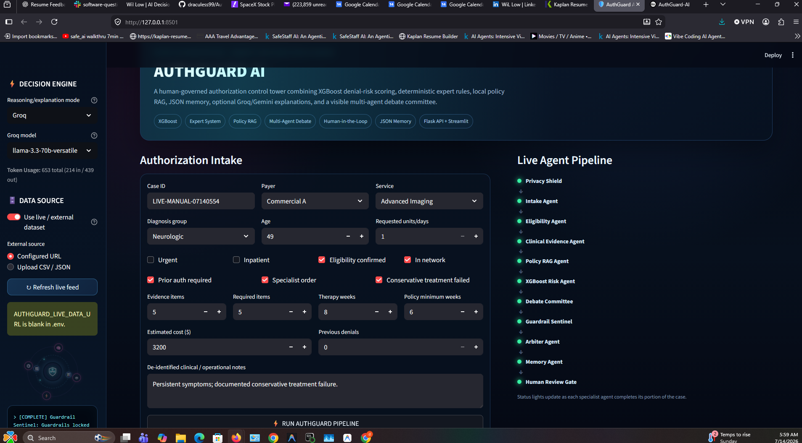

---

[](LICENSE)

## Project Links

- **Live Demo:** https://medpackai-production.up.railway.app/
- **GitHub Repository:** https://github.com/draculess99/MEDPACK_AI/
- **LinkedIn:** https://www.linkedin.com/in/gammaconsult/
- **Portfolio:** https://draculess99.github.io/

---

## What dataset is included?

The bundled XGBoost classifier is trained on **2,200 reproducibly generated synthetic rows** created inside `backend/model.py` with NumPy. It does **not** contain real patients, payer records, claims, protected health information, or genuine authorization outcomes.

The synthetic generator creates 14 structured model features and then produces a proxy denial label from a logistic probability function. The strongest synthetic risk drivers include missing documentation, weak evidence coverage, out-of-network status, insufficient conservative therapy, missing specialist orders, prior denials, payer complexity, service risk, urgency, and cost-related signals.

| Model feature | Meaning |
|---|---|
| `age_years` | Age entered for the demonstration case |
| `urgency_score` | Standard versus urgent request |
| `inpatient` | Inpatient indicator |
| `in_network` | Network status |
| `evidence_ratio` | Evidence received divided by required evidence |
| `therapy_gap_weeks` | Shortfall against the configured policy minimum |
| `failed_conservative_therapy` | Whether failure or intolerance is documented |
| `specialist_order` | Presence of a specialist order |
| `log_estimated_cost` | Log-transformed estimated cost |
| `previous_denials` | Prior denial count |
| `requested_units` | Requested units or days |
| `payer_complexity` | Demonstration payer complexity score |
| `service_risk` | Demonstration service-category risk score |
| `missing_document_count` | Required evidence still missing |

Bundled demonstration metrics are stored in `models/model_metrics.json`. They verify that the software pipeline is connected; they do not establish payer, clinical, legal, or production validity.

### Synthetic versus live/external data

The sidebar now includes a **Use live / external dataset** switch.

- **Synthetic mode** uses the bundled demonstration scenarios.
- **Live/external mode** loads de-identified records from either:
  - a CSV, JSON, or JSONL upload; or
  - a URL configured through `AUTHGUARD_LIVE_DATA_URL`.

The external-data adapter validates the URL scheme, response size, record count, required schema, numeric ranges, and normalized field types. Private or loopback URLs are blocked by default. A bearer token can be supplied through `.env` without displaying it in the interface.

> The external switch changes the **case-input source**. The included XGBoost artifact remains the synthetic demonstration model. Training a genuine model would require a separately governed, payer-specific labeled outcome dataset and a formal validation process.

A schema-ready example is provided at `data/live_data_template.csv`. It is synthetic and is intended only as a formatting template.

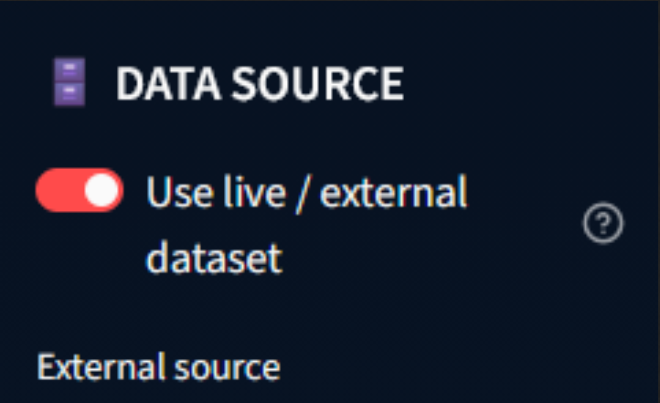

---

## Major implemented features

### Command-center user experience

- Dark operations-center Streamlit interface
- Responsive intake form
- Animated top-right processing spinner
- Side-console radar animation and rolling execution log
- Eleven pipeline status lights that move from pending to running to complete/error
- Decision, denial-risk, committee-vote, and human-gate summary cards
- Six evidence and governance tabs
- Raw structured-result viewer for technical inspection

### Decision intelligence

- XGBoost denial-risk classifier
- Deterministic expert-system rules
- Policy/documentation RAG using TF-IDF retrieval
- Similar-case JSON memory
- Multi-agent debate committee
- Guardrail-locked arbiter recommendation
- Human review workflow with approve-package, request-evidence, and reject/reroute actions
- Flask API for programmatic processing and review

### External model options

- Local Expert System mode requiring no API key
- Groq explanation mode
- Gemini explanation mode
- Dynamic model dropdown that appears only when Groq or Gemini is selected
- Model choice passed through the Streamlit UI, Flask API, orchestrator, and provider client
- Automatic deterministic fallback when an API key, provider, or model is unavailable
- External models are explanation-only and cannot change routing

### Security and governance controls

- SSN, phone, and email redaction
- Prompt-injection phrase detection
- Automatic LLM bypass after injection detection
- Mandatory human escalation for urgent, high-risk, blocked, or unsafe cases
- Guardrails can only make a route stricter, never more permissive
- Missing evidence cannot be cleared by an LLM
- External dataset size and record-count limits
- Live URL scheme validation and private-address blocking
- Environment secrets excluded through `.gitignore`
- JSON audit trail for human decisions
- Explicit non-submission and non-coverage disclaimer

---

## System architecture

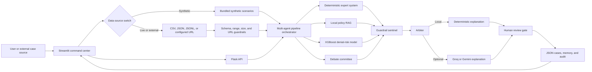

### Trust boundary

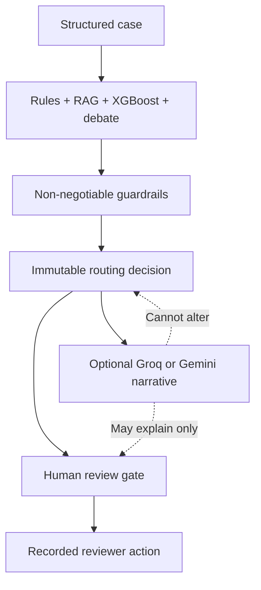

---

## Multi-agent pipeline

```mermaid
flowchart LR
    P1["1 Privacy Shield"] --> P2["2 Intake Agent"]
    P2 --> P3["3 Eligibility Agent"]
    P3 --> P4["4 Clinical Evidence Agent"]
    P4 --> P5["5 Policy RAG Agent"]
    P5 --> P6["6 XGBoost Risk Agent"]
    P6 --> P7["7 Debate Committee"]
    P7 --> P8["8 Guardrail Sentinel"]
    P8 --> P9["9 Arbiter Agent"]
    P9 --> P10["10 Memory Agent"]
    P10 --> P11["11 Human Review Gate"]
```

| Stage | Responsibility |
|---|---|
| Privacy Shield | Validates the case, redacts common PII patterns, and detects prompt injection |
| Intake Agent | Normalizes identifiers and attaches workflow metadata |
| Eligibility Agent | Checks eligibility, network, and prior-authorization requirement |
| Clinical Evidence Agent | Applies deterministic evidence and policy-threshold rules |
| Policy RAG Agent | Retrieves relevant local policy and documentation chunks |
| XGBoost Risk Agent | Produces denial probability, risk band, and feature contributions |
| Debate Committee | Records support, opposition, caution, evidence, confidence, and recommendations |
| Guardrail Sentinel | Locks the safest permissible route |
| Arbiter Agent | Reconciles the structured outcome and creates an explanation |
| Memory Agent | Finds similar cases and stores the result |
| Human Review Gate | Pauses cases requiring qualified review and records final human action |

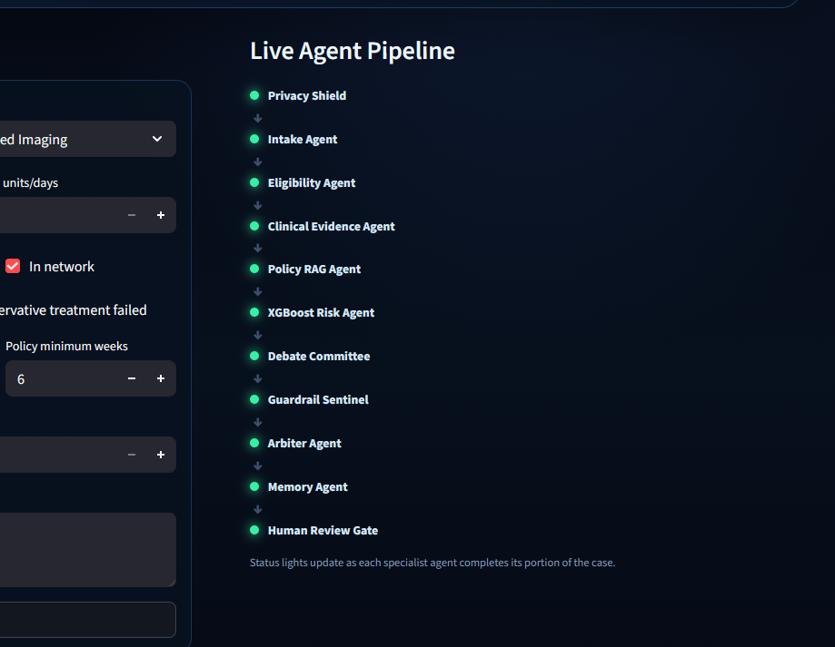

---

## Debate committee

The committee is intentionally not a single-agent yes/no answer. It exposes disagreement and evidence from multiple specialist perspectives:

- Coverage and eligibility position
- Clinical evidence position
- Policy RAG position
- XGBoost denial-risk position
- Devil's advocate position
- Compliance and safety position

Each member reports:

- stance: `SUPPORT`, `OPPOSE`, or `CAUTION`;
- confidence score;
- evidence list; and
- recommended next action.

The committee vote helps the arbiter explain the outcome, but the final route remains constrained by deterministic guardrails.

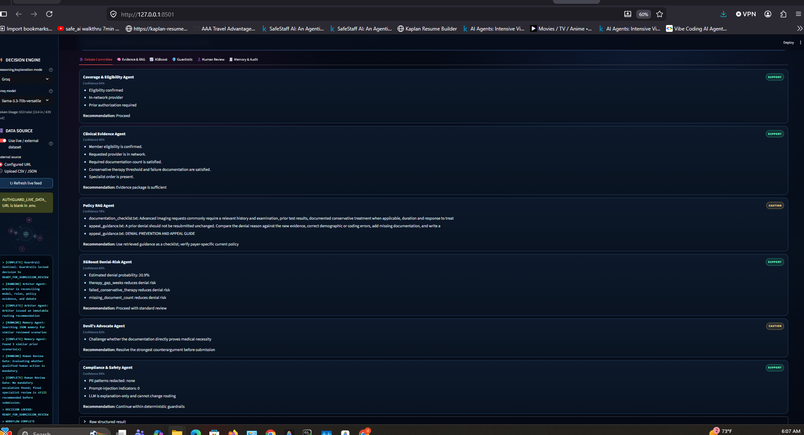

---

## End-to-end data flow

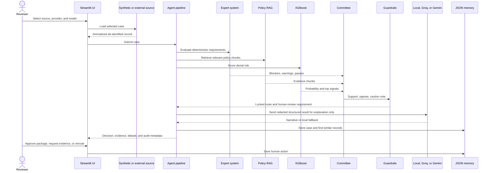

### Data-source decision flow

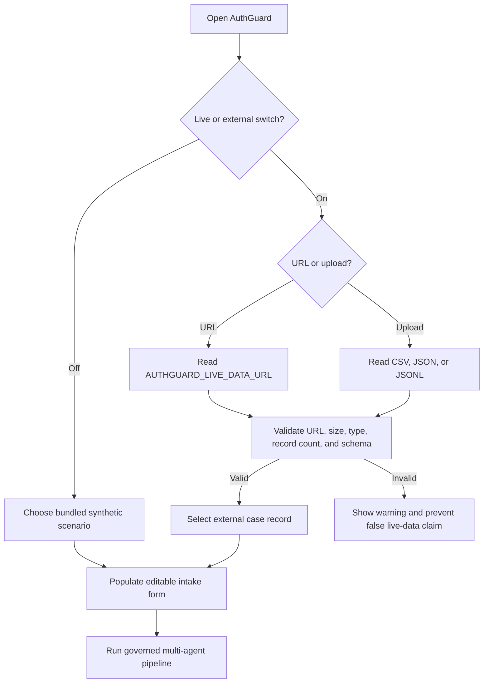

---

## RAG implementation

The RAG layer reads local text documents from `data/knowledge/`, chunks them, builds a TF-IDF index, and returns the most relevant policy/documentation guidance for the current payer, service, diagnosis group, urgency, and evidence questions.

Included demonstration knowledge:

- general payer-policy guidance;
- documentation checklist;
- appeal guidance; and
- security/governance guidance.

RAG output is advisory. Current payer-specific policy must be independently verified before operational use.

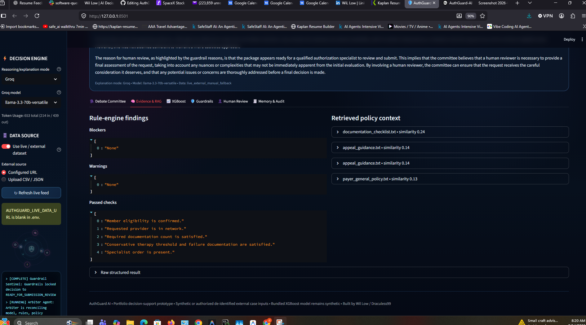

```text
Patient / Authorization Request
            ↓
     Data Validation
            ↓
   ┌───────────────────────┐
   │                       │
   │   XGBoost Risk Model  │
   │   • denial risk       │
   │   • urgency score     │
   │   • routing signal    │
   │                       │
   └──────────┬────────────┘
              │
              ├──────────────┐
              │              │
              ↓              ↓
   RAG Knowledge Search   Expert Rules
   • payer guidance       • eligibility checks
   • documentation        • missing documents
   • appeal guidance      • escalation triggers
              │              │
              └──────┬───────┘
                     ↓
          Decision Orchestration
                     ↓
      Recommendation + Explanation
                     ↓
          Human Review / Escalation
```

---

## Human-in-the-loop and guardrails

AuthGuard requires human review when any of the following are present:

- prompt-injection indicators;
- eligibility uncertainty;
- unresolved blocking documentation;
- urgent/expedited requests;
- critical denial risk;
- high denial risk where the route would otherwise be ready;
- unresolved non-blocking policy warnings; or
- committee opposition sufficient to require escalation.

Human reviewers can record:

- `APPROVE_PACKAGE_FOR_SUBMISSION`;
- `REQUEST_ADDITIONAL_EVIDENCE`; or
- `REJECT_OR_REROUTE`.

These actions are written to the JSON audit log. The prototype still does not transmit anything to a payer.

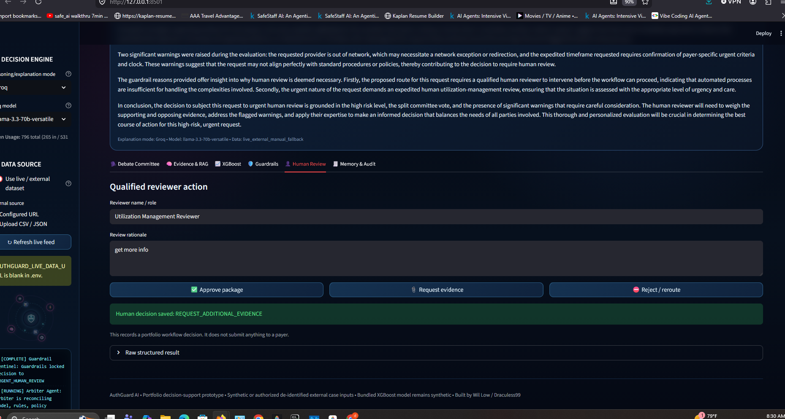

---

## JSON memory and audit

| File | Purpose |
|---|---|
| `database/cases.json` | Completed structured pipeline results |
| `database/memory_history.json` | Compact case summaries for similarity matching |
| `database/audit_log.json` | Human-review actions and rationale |
| `database/memory_state.json` | Processed/reviewed counters and state |

For Railway persistence, mount a volume and set `AUTHGUARD_DATA_DIR=/data/authguard`. Use one replica while JSON persistence is active. A production deployment should migrate to a managed transactional database with authentication, role-based access, encryption, retention controls, and concurrency-safe writes.


---

## Provider and model selection

The first dropdown selects the explanation provider. A second dropdown appears only for Groq or Gemini.

### Groq choices

- `llama-3.3-70b-versatile`
- `llama-3.1-8b-instant`
- `openai/gpt-oss-20b`
- `openai/gpt-oss-120b`

### Gemini choices

- `gemini-3.5-flash`
- `gemini-3.1-pro-preview`
- `gemini-2.5-flash`
- `gemini-2.5-flash-lite`
- `gemini-2.5-pro`

The lists are curated defaults. The value in `.env` is inserted into the dropdown even if a provider introduces a newer identifier.

---

## Environment configuration

A ready-to-fill `.env` file and a shareable `.env.example` are included.

```env
# GroqCloud
GROQ_API_KEY=
GROQ_MODEL=llama-3.3-70b-versatile

# Google Gemini
GEMINI_API_KEY=
GEMINI_MODEL=gemini-2.5-flash

# Optional de-identified external data source
AUTHGUARD_LIVE_DATA_URL=
AUTHGUARD_LIVE_DATA_BEARER_TOKEN=
AUTHGUARD_LIVE_DATA_TIMEOUT=20
AUTHGUARD_LIVE_DATA_MAX_BYTES=5242880
AUTHGUARD_LIVE_DATA_MAX_RECORDS=5000
AUTHGUARD_ALLOW_PRIVATE_LIVE_URL=false

AUTHGUARD_API_PORT=5008
AUTHGUARD_DATA_DIR=
```

Never commit populated secrets. `.env` is already listed in `.gitignore`.

---

## External dataset schema

At minimum, each CSV/JSON record needs values that map to:

```text
case_id
payer
service_type
diagnosis_group
```

The adapter also recognizes aliases such as `request_id`, `authorization_id`, `payer_name`, `health_plan`, `service`, `request_type`, `diagnosis`, and `condition_group`.

Recommended full schema:

```text
case_id,payer,service_type,diagnosis_group,age_years,urgent,inpatient,
prior_auth_required,member_eligible,in_network,requested_units,evidence_count,
required_document_count,conservative_therapy_weeks,guideline_min_weeks,
failed_conservative_therapy,specialist_order,estimated_cost,previous_denials,
clinical_notes
```

The loader normalizes common Boolean and numeric representations, applies safe defaults to optional fields, and rejects a dataset when no valid record remains.

---

## Run locally

### Windows

```bat
run_local.bat
```

### macOS or Linux

```bash
chmod +x run_local.sh
./run_local.sh
```

### Manual launch

```bash
python -m pip install -r requirements.txt
python app.py
```

Open:

- Streamlit: `http://localhost:8501`
- Flask health: `http://localhost:5008/health`

---

## Flask API

### Health

```bash
curl http://localhost:5008/health
```

### Process a case with a selected provider model

```bash
curl -X POST http://localhost:5008/api/process \
  -H "Content-Type: application/json" \
  -d '{
    "provider": "Groq",
    "provider_model": "llama-3.3-70b-versatile",
    "case": {
      "case_id": "AG-1001",
      "payer": "Commercial A",
      "service_type": "Advanced Imaging",
      "diagnosis_group": "Neurologic",
      "age_years": 49,
      "urgent": false,
      "inpatient": false,
      "prior_auth_required": true,
      "member_eligible": true,
      "in_network": true,
      "requested_units": 1,
      "evidence_count": 5,
      "required_document_count": 5,
      "conservative_therapy_weeks": 8,
      "guideline_min_weeks": 6,
      "failed_conservative_therapy": true,
      "specialist_order": true,
      "estimated_cost": 3200,
      "previous_denials": 0,
      "clinical_notes": "De-identified demonstration note",
      "data_source": "synthetic_demo"
    }
  }'
```

Other endpoints:

- `POST /api/review`
- `GET /api/cases`
- `GET /api/memory`
- `GET /api/audit`
- `GET /api/model/metrics`
- `GET /api/knowledge`

---

## Railway deployment

The package runs Streamlit and Flask as one Railway service:

```text
web: python app.py
```

`app.py` starts Waitress for Flask on `AUTHGUARD_API_PORT` and Streamlit on Railway's assigned `PORT`.

Recommended Railway variables:

```env
GROQ_API_KEY=your_secret
GEMINI_API_KEY=your_secret
AUTHGUARD_DATA_DIR=/data/authguard
AUTHGUARD_LIVE_DATA_URL=https://your-authorized-source.example/cases.json
```

Do not put real secrets in the repository.

---

## Tests

Run:

```bash
pytest -q
```

The test suite covers:

- PII redaction;
- prompt-injection detection;
- expert-system blockers;
- complete multi-agent execution;
- external-LLM bypass after injection detection;
- deterministic synthetic dataset generation;
- live CSV upload parsing and normalization;
- live JSON parsing and alias mapping;
- URL-based live loader behavior through a mocked HTTP response;
- invalid external schema rejection; and
- Groq/Gemini model-choice availability.

Provider API calls are not executed without real keys. Unavailable providers automatically fall back to the local deterministic explanation.

---

## Project structure

```text
AuthGuard_AI/
├── app.py
├── backend/
│   ├── agents/committee.py
│   ├── data_sources.py
│   ├── expert_system.py
│   ├── guardrails.py
│   ├── llm_clients.py
│   ├── memory.py
│   ├── model.py
│   ├── rag.py
│   └── server.py
├── frontend/dashboard.py
├── data/
│   ├── knowledge/
│   ├── live_data_template.csv
│   └── sample_case.json
├── database/
├── docs/images/
├── models/
├── tests/
├── .env
├── .env.example
├── requirements.txt
├── Procfile
└── README.md
```

---

## Recommended screenshots

Capture these after launching the application:

1. Full command center with intake and pipeline visible.
2. Synthetic/live switch with the external URL/upload controls.
3. Pipeline actively running with lights, radar, and top-right spinner.
4. Debate committee showing support, opposition, and caution.
5. RAG evidence and XGBoost top signals.
6. Guardrail reasons and mandatory human-review action panel.
7. Similar-case memory and human-audit history.

The placeholder images are already in `docs/images/`. Replace them with your PNG screenshots and change the README extensions from `.svg` to `.png`.

---

## Production limitations and next steps

A production-grade system would still require:

- payer-specific, temporally valid policy integrations;
- standardized FHIR/Da Vinci prior-authorization workflows;
- genuine labeled outcomes under data-use and privacy governance;
- probability calibration and threshold approval;
- fairness, subgroup, leakage, and external-validation studies;
- authentication, RBAC, encryption, secrets management, and PHI controls;
- managed database persistence;
- policy versioning and citation lineage;
- model and policy drift monitoring;
- reviewer identity and electronic-signature controls;
- operational observability, retry queues, and incident response; and
- qualified legal, clinical, compliance, security, and payer review.

---

## Summary

**AuthGuard AI is an agentic prior-authorization control tower.** It accepts synthetic or authorized de-identified external cases, predicts denial risk with XGBoost, evaluates deterministic requirements, retrieves relevant policy evidence, exposes a multi-agent debate, locks the safest route through non-negotiable guardrails, and pauses the workflow for a qualified human wherever risk or policy demands it.

Built by **Wil Low / Draculess99**.
"# AuthGuard-AI" 
