# BedFlow AI

<p align="center">
  <strong>Agentic discharge-flow intelligence for patient prioritization, operational coordination, capacity planning, and human-supervised decision support</strong>
</p>

<p align="center">
  
  
  
  
  
  
  
  
  
  
</p>

BedFlow AI is a portfolio-grade hospital operations command center that combines predictive analytics, discharge-readiness workflow, task coordination, agentic decision support, human accountability, capacity simulation, interoperability, and operational observability.

The application helps an authorized hospital team answer three practical questions:

1. **Which patient cases should be reviewed first?**
2. **What is preventing each patient from progressing toward discharge?**
3. **Which operational intervention may relieve the most bed pressure?**

> **Safety boundary:** BedFlow AI is a demonstration and decision-support system. It does not diagnose, authorize discharge, replace clinical judgment, or connect to a live electronic health record.

---

[](LICENSE)

## Project Links

- **Live Demo:** https://medpackai-production.up.railway.app/
- **GitHub Repository:** https://github.com/draculess99/MEDPACK_AI/
- **LinkedIn:** https://www.linkedin.com/in/gammaconsult/
- **Portfolio:** https://draculess99.github.io/

---

## Contents

- [Product overview](#product-overview)
- [Core capabilities](#core-capabilities)
- [Visual tour](#visual-tour)
- [System architecture](#system-architecture)
- [End-to-end workflow](#end-to-end-workflow)
- [Predictive analytics](#predictive-analytics)
- [Discharge workflow and task coordination](#discharge-workflow-and-task-coordination)
- [Agentic decision support](#agentic-decision-support)
- [Human decision and accountability](#human-decision-and-accountability)
- [Role-aware access](#role-aware-access)
- [Capacity simulator](#capacity-simulator)
- [FHIR-shaped interoperability](#fhir-shaped-interoperability)
- [Model quality and transparency](#model-quality-and-transparency)
- [Persistent JSON storage](#persistent-json-storage)
- [System operations](#system-operations)
- [Dashboard guide](#dashboard-guide)
- [Data and model provenance](#data-and-model-provenance)
- [API overview](#api-overview)
- [Quick start](#quick-start)
- [Docker and Railway](#docker-and-railway)
- [Testing](#testing)
- [Project structure](#project-structure)
- [Future work](#future-work)
- [Known limitations](#known-limitations)

---

## Product overview

Hospital discharge delays are rarely caused by one issue. A patient may be medically stable but still require medication reconciliation, transport, insurance authorization, home-care coordination, rehabilitation placement, or final clinician review.

BedFlow AI brings those signals into one operational workflow:

- a simulated unit bed board shows where capacity pressure exists;
- a model-scored queue identifies cases that deserve earlier review;
- a readiness checklist exposes unresolved blockers;
- owned tasks assign responsibility and escalation timing;
- three XGBoost models estimate delay and readmission risk;
- an agentic committee weighs patient safety against hospital flow;
- a human reviewer records the final accountable action;
- a capacity simulator compares operational scenarios;
- FHIR R4-shaped JSON supports interoperability demonstrations;
- persistent JSON storage can be placed on a Railway or Docker volume without introducing PostgreSQL;
- system health, readiness, request tracing, and metrics support reliable operation.

---

## Core capabilities

| Capability | What it provides |
|---|---|
| **Hospital command center** | Simulated occupancy, open beds, delayed discharges, expected discharges, and ED boarding pressure by unit |
| **Prioritized discharge queue** | Cached patient-level XGBoost scores, blockers, owners, recommended actions, and review priority |
| **Discharge-readiness checklist** | Clinical, medication, transport, placement, insurance, home-care, and social-work requirements |
| **Task coordination** | Role ownership, status, service-level timer, overdue state, escalation level, and immutable persistent JSON event history |
| **Predictive analytics** | Discharge-delay probability, 30-day readmission probability, and expected delay hours |
| **Model transparency** | Active patient signals, feature importance, metrics, registry, history, and model card |
| **Agentic committee** | Patient Safety Advocate, Operations & Flow Manager, and Clinical Director synthesis |
| **Human accountability** | Identity-bound decisions, mandatory rationale for exceptions, audit snapshots, and CSV export |
| **Role-aware workflow** | Signed local identities and backend-enforced permissions for operational and clinical roles |
| **Capacity simulator** | Counterfactual operational scenarios with before-and-after patient and unit impact |
| **FHIR-shaped export** | De-identified Patient, Encounter, Observation, Task, CarePlan, Location, and Bundle resources |
| **Persistent JSON storage** | Configurable runtime directory for users, tasks, audit, memory, and simulations; compatible with a Railway `/data` volume |
| **System operations** | Liveness, readiness, version, request IDs, latency, structured logs, security headers, and administrator metrics |
| **Delivery tooling** | Docker, Railway configuration, GitHub Actions, secret scanning, smoke checks, and clean packaging |

---

## Visual Tour

### Hospital Command Center
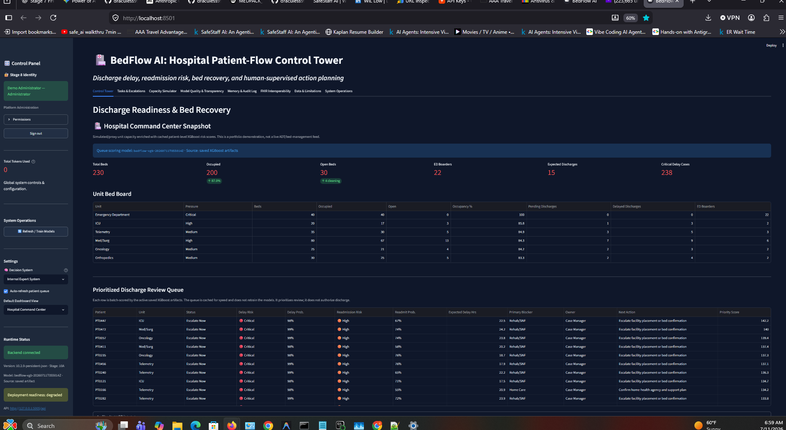
*The live operational bed board showing unit capacity alongside the ML-scored discharge queue.*

### Patient Case Review
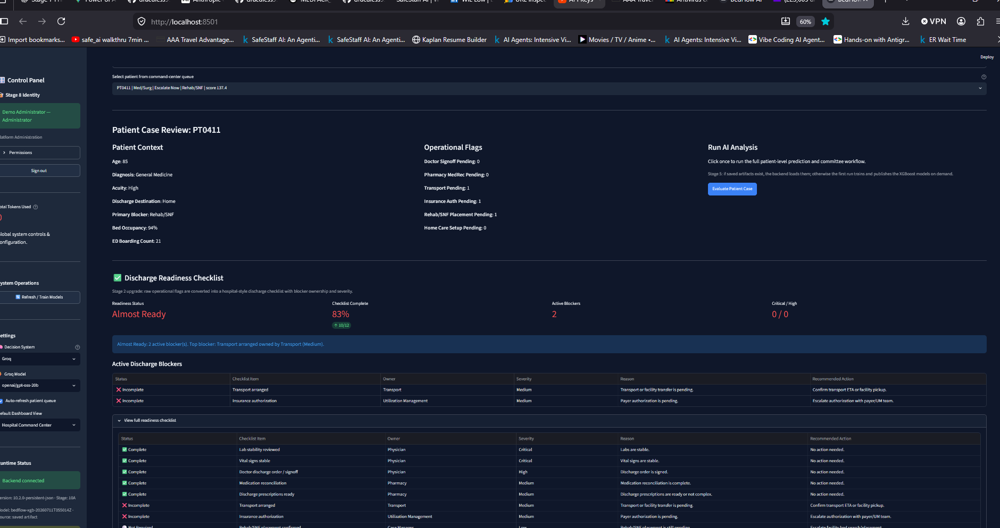
*Deep dive into a specific patient's operational bottlenecks and auto-generated readiness checklist.*

### Multi-Agent Committee Debate
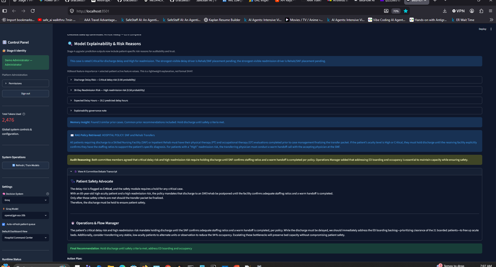
*The AI Committee (Safety, Operations, Director) actively debating the discharge plan using retrieved hospital policies.*

### Task & Escalation Workflow
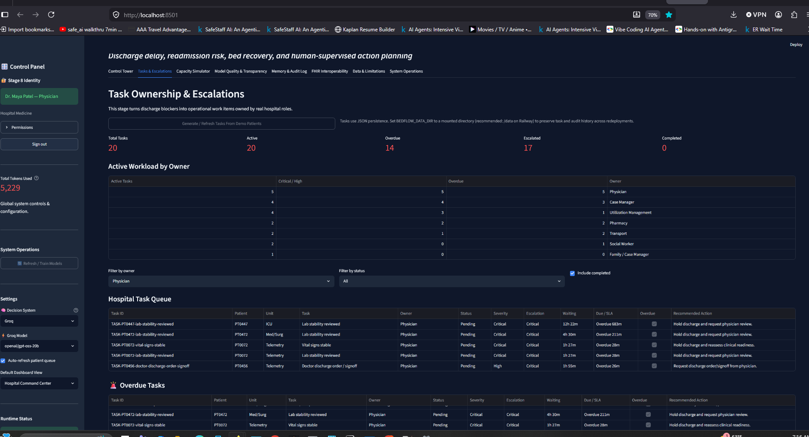
*Role-assigned tasks complete with SLAs, escalation timers, and an immutable audit log of ownership.*

### Capacity Simulator

*Counterfactual "What-If" planning to predict the bed-recovery impact of resolving specific hospital blockers.*

### FHIR Interoperability
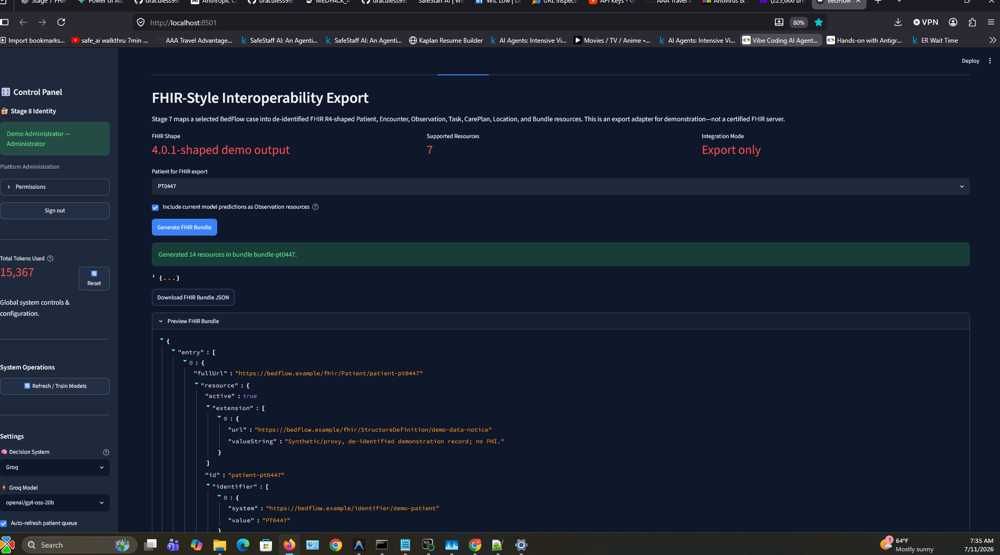
*Generating a compliant FHIR R4 JSON bundle of the patient's case for seamless EHR integration.*

---

## System architecture

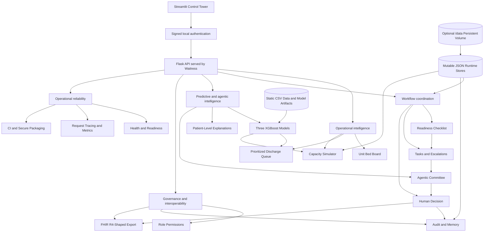

Static datasets and trained model artifacts remain inside the application package. Mutable records can be redirected with `BEDFLOW_DATA_DIR`; on Railway, mount a persistent volume at `/data` and set `BEDFLOW_DATA_DIR=/data`.

---

## End-to-end workflow

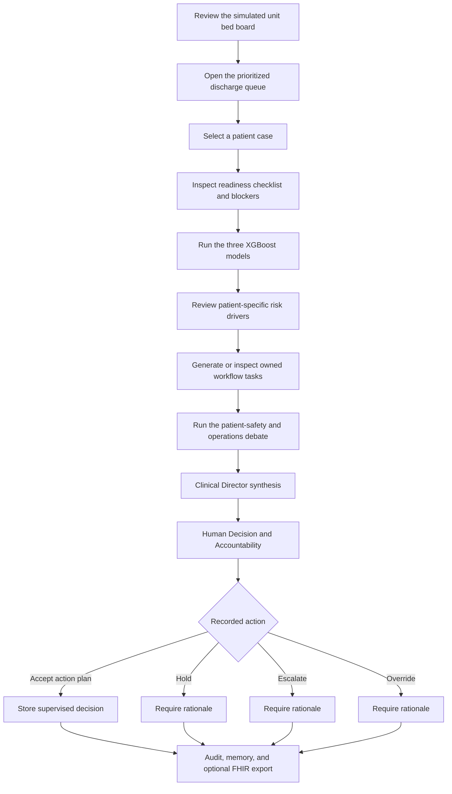

The human action records acceptance or rejection of the **recommended action plan**. It does not independently authorize clinical discharge.

---

## Predictive analytics

BedFlow AI uses three separately trained XGBoost models. The same patient record is aligned to the saved feature schema and passed through each model.

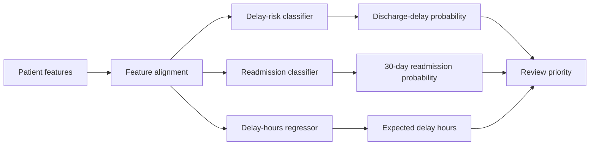

| Output | Model type | Operational question |
|---|---|---|
| **Discharge-delay risk** | XGBoost classifier | How likely is the patient to experience a discharge delay? |
| **30-day readmission risk** | XGBoost classifier | How likely is the patient to return within 30 days? |
| **Expected delay hours** | XGBoost regressor | Approximately how many delay hours are associated with the current case? |

### Model-scored queue

The prioritized queue uses the active saved model artifacts. It does not use known outcome columns to imitate future predictions.

Each queue row contains:

- discharge-delay probability and risk band;
- 30-day readmission probability and risk band;
- expected delay-hours estimate;
- primary discharge blocker;
- responsible owner;
- recommended operational action;
- composite review-priority score;
- active model version and prediction timestamp.

The queue identifies candidates for **earlier review**. It does not automatically discharge patients.

---

## Discharge workflow and task coordination

### Readiness checklist

The checklist organizes requirements into understandable operational domains:

- clinical stability and physician sign-off;
- medication reconciliation and discharge prescriptions;
- transport or family pickup;
- insurance authorization;
- rehabilitation, skilled nursing, or long-term-care placement;
- home-care services;
- social-work review;
- follow-up and transition planning.

### Tasks and escalations

Unresolved checklist items can become role-owned tasks containing:

- patient and task identifiers;
- operational owner;
- current status;
- service-level target;
- time remaining or overdue duration;
- escalation level;
- authenticated actor and note.

Every status change also creates an append-only task event with the previous state, new state, actor, role, timestamp, and rationale.

---

## Agentic decision support

The committee uses a deliberately small set of agents with different responsibilities.

| Agent | Primary concern |
|---|---|
| **Patient Safety Advocate** | Clinical stability, readmission risk, medication safety, and incomplete transitions |
| **Operations & Flow Manager** | Bed pressure, discharge barriers, throughput, ownership, and task sequencing |
| **Clinical Director** | Reconciles competing viewpoints and produces a supervised action plan |

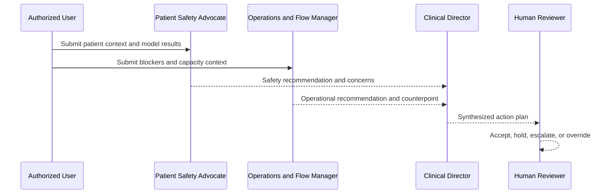

Committee execution modes:

- **Internal Expert System** — deterministic local reasoning with no API key;
- **Groq** — optional language-model mode;
- **Gemini** — optional language-model mode.

More agents are not automatically better. A specialist agent should be introduced only when it contributes unique data, authority, or reasoning.

---

## Human decision and accountability

The final review is not a checkbox confirming that somebody looked at the AI output. It is the accountable decision point in the workflow.

A reviewer examines:

- all three model outputs;
- active model drivers;
- the readiness checklist;
- unresolved tasks and escalations;
- the agentic committee’s action plan;
- clinical and operational context.

The reviewer can record:

| Human action | Meaning |
|---|---|
| **Accept recommended action plan** | Proceed with the proposed operational plan under authorized supervision |
| **Hold** | Stop progression until named issues are resolved |
| **Escalate** | Route the case to higher authority or specialist review |
| **Override** | Reject the proposed plan and document a different action |

Every decision stores identity, role, patient, model version, AI recommendation, human action, rationale, timestamp, checklist snapshot, task snapshot, model outputs, and explanation snapshot.

A written rationale is mandatory for hold, escalate, and override actions.

---

## Role-aware access

BedFlow AI includes a signed local demonstration identity layer. Permissions are enforced in the Flask backend rather than only hidden in the interface.

| Role | Main authority |
|---|---|
| **Administrator** | Model operations, all tasks, all human actions, capacity scenarios, audit export, access events, and metrics |
| **Bed Manager** | All operational tasks, supervised decisions, and capacity scenarios |
| **Physician** | Physician-owned tasks and all committee decision actions |
| **Nurse** | Nursing tasks plus hold or escalate actions |
| **Pharmacist** | Pharmacy-owned tasks |
| **Case Manager** | Placement and home-care tasks plus hold or escalate actions |
| **Utilization Manager** | Insurance-authorization tasks plus hold or escalate actions |
| **Social Worker** | Social-work-owned tasks |
| **Transport Coordinator** | Transport-owned tasks |

The demonstration layer provides:

- signed, time-limited bearer tokens;
- token-bound reviewer identity;
- role-owned task permissions;
- restricted model operations;
- protected audit and metrics access;
- login and access-event records.

> A real multi-user deployment should replace the local identity store with enterprise SSO or OIDC, MFA, HTTPS, managed sessions, and database-backed identity governance.

---

## Capacity simulator

The Capacity Simulator tests hypothetical operational interventions against the current demonstration cohort. It changes selected operational inputs, runs the same saved models again, and compares the current and counterfactual results.

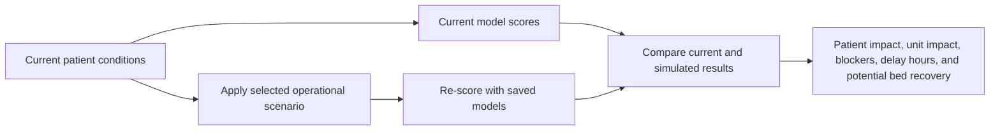

### Available scenario levers

- clear a percentage of pharmacy blockers;
- resolve insurance authorizations;
- improve transport availability;
- complete home-care setup;
- resolve social-work requirements;
- clear selected rehabilitation or skilled-nursing placements;
- add bounded case-manager availability;
- release beds waiting for cleaning;
- open temporary staffed beds;
- limit the scenario by unit and planning horizon.

### Scenario results

- patients affected and improved;
- potential expedited-review candidates;
- potential workflow beds recovered;
- predicted delay hours removed;
- reduction in High or Critical delay cases;
- operational blockers removed;
- possible ED boarding relief;
- unit-level and patient-level impact.

Clinical stability, vital-sign stability, and physician sign-off are never cleared by the simulator. Results are planning estimates from synthetic and proxy relationships, not guaranteed outcomes or causal proof.

---

## FHIR-shaped interoperability

The export adapter maps a selected de-identified BedFlow case to FHIR R4-shaped JSON resources:

- `Patient`
- `Encounter`
- `Observation`
- `Task`
- `CarePlan`
- `Location`
- `Bundle`

Model outputs can be represented as `Observation` resources, unresolved work as `Task` resources, and the supervised action plan as a `CarePlan`.

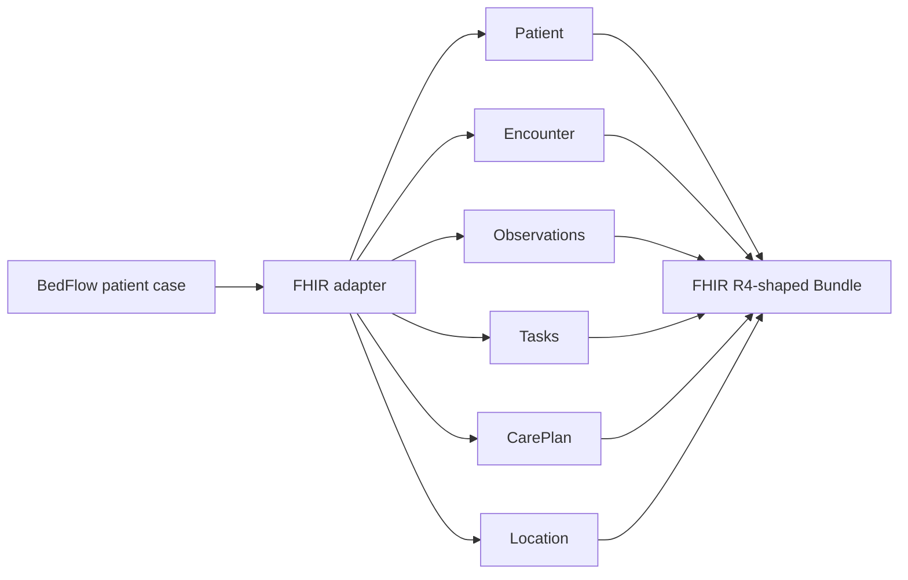

The adapter is an export demonstration, not a certified FHIR server. It does not implement SMART on FHIR, OAuth, terminology validation, persistence, or live EHR connectivity.

---

## Model quality and transparency

### Saved artifacts

The backend loads saved artifacts at startup so patient scoring does not require retraining.

| Artifact | Purpose | Required for scoring |
|---|---|---:|
| `models/discharge_delay_xgb.joblib` | Trained discharge-delay classifier | Yes |
| `models/readmission_xgb.joblib` | Trained readmission classifier | Yes |
| `models/delay_hours_xgb.joblib` | Trained delay-hours regressor | Yes |
| `models/feature_columns.json` | Exact feature names and ordering | Yes |
| `models/model_registry.json` | Active version, timestamp, source, and artifact paths | Metadata |
| `models/model_card.md` | Intended use, metrics, and limitations | Documentation |
| `database/model_metrics.json` | Current evaluation snapshot | Dashboard |
| `database/model_metrics_history.json` | Historical training summaries | Dashboard |

### Evaluation snapshot

| Model | Metric | Value |
|---|---:|---:|
| Discharge-delay classifier | ROC-AUC | 0.992 |
| Discharge-delay classifier | F1 | 0.959 |
| Readmission classifier | ROC-AUC | 0.663 |
| Readmission classifier | Recall at 0.55 threshold | 0.460 |
| Delay-hours regressor | MAE | 1.89 hours |
| Delay-hours regressor | RMSE | 2.51 hours |
| Delay-hours regressor | R² | 0.871 |

The operational delay models are trained on synthetic, rule-structured data, so their strong scores demonstrate the software pipeline rather than clinical validity. The public-data readmission model is more realistic but has only modest discrimination and remains a proxy model.

### Patient-level explanation

The explanation panel combines:

- native XGBoost feature importance;
- the selected patient’s active feature values;
- plain-English operational context.

This is a lightweight transparency mechanism, not formal SHAP attribution.

---

## Persistent JSON storage

BedFlow AI keeps JSON rather than introducing PostgreSQL. The storage layer separates **static application assets** from **mutable runtime records**.

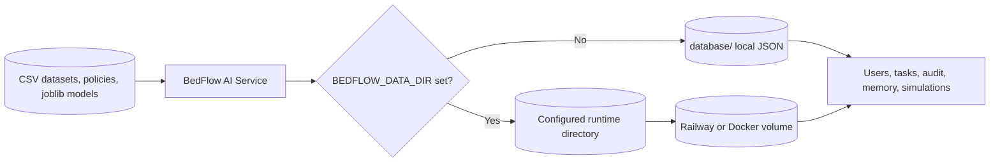

Mutable files include:

```text
demo_users.json
access_log.json
tasks.json
task_events.json
audit_log.json
simulation_runs.json
bedflow_memory_state.json
bedflow_memory_history.json
```

The application creates missing files on first startup. If an external directory is empty, packaged seed data is copied when available; otherwise safe empty/default JSON payloads are created. Existing mounted data is never replaced.

### Local mode

No configuration is required:

```bash
python app.py
```

To keep runtime records outside the repository:

```bash
BEDFLOW_DATA_DIR=./data python app.py
```

### Railway mode

1. Attach a volume to the BedFlow AI service.
2. Mount it at `/data`.
3. Set `BEDFLOW_DATA_DIR=/data`.
4. Keep the service at one replica when using JSON persistence.
5. Confirm the directory through `/api/ready` or the **System Operations** tab.

This gives the portfolio app restart-safe persistence without the cost or complexity of a separate PostgreSQL service. JSON mode is still intended for a single application instance and low write volume.


---

## System operations

The System Operations area provides application reliability and support information without altering patient scoring or workflow logic.

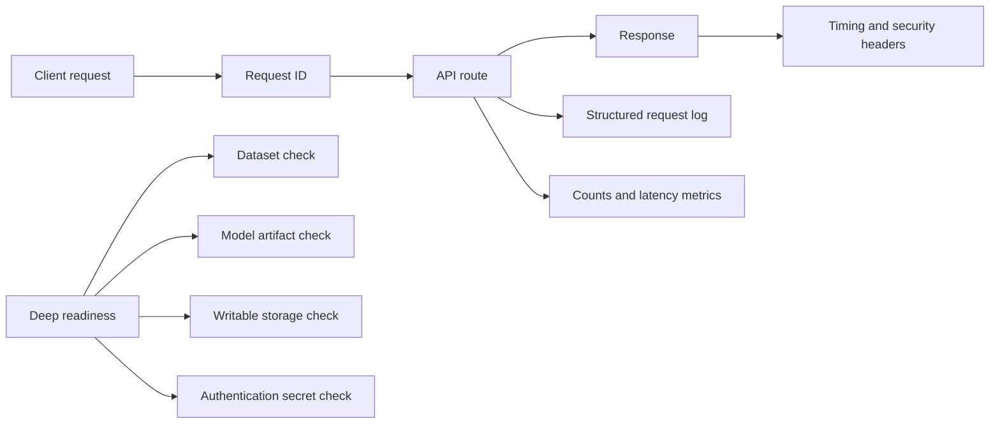

Operational features include:

- lightweight liveness probe;
- deeper dataset, model, artifact, storage, and secret readiness checks;
- application version information;
- request IDs and response timing;
- security headers;
- structured request logs;
- administrator-only request counts, endpoint use, status distribution, and latency;
- GitHub Actions for secret scanning, compilation, automated tests, smoke checks, and clean packaging;
- scripts that exclude secrets, Git history, password hashes, access logs, and caches from distributable archives.

In-process metrics reset when the API process restarts. A production environment should forward logs and metrics to a managed observability service.

---

## Dashboard guide

| Tab | Main purpose |
|---|---|
| **Control Tower** | Unit capacity, prioritized queue, patient review, predictions, explanations, committee, and human decision |
| **Tasks & Escalations** | Role-owned work, status, SLA timing, overdue tasks, escalation, and immutable events |
| **Capacity Simulator** | Operational what-if scenarios and before-and-after impact |
| **Model Quality & Transparency** | Model purpose, artifacts, provenance, metrics, history, importance, and model card |
| **Memory & Audit Log** | Decision history, filters, task events, access events, and authorized CSV export |
| **FHIR Interoperability** | Build, preview, and download a FHIR R4-shaped bundle |
| **Data & Limitations** | Data sources, synthetic/public split, decision boundaries, and limitations |
| **System Operations** | Health, readiness, version, request metrics, latency, and deployment warnings |

---

## Data and model provenance

BedFlow AI uses a transparent hybrid data design.

| Component | Source | Interpretation |
|---|---|---|
| Discharge-delay classifier | `database/bedflow_patient_data.csv` | Synthetic/proxy operational model |
| Delay-hours regressor | `database/bedflow_patient_data.csv` | Synthetic/proxy operational model |
| 30-day readmission classifier | `database/readmission_training_data.csv` | Public diabetes hospital encounters transformed to the BedFlow schema |
| Unit bed board | Fixed capacity assumptions and proxy pressure fields | Simulated operational snapshot |
| Capacity simulator | Counterfactual operational inputs followed by saved-model inference | Demonstration planning estimate |
| Tasks, audit, memory, users, scenarios | JSON stores resolved through `BEDFLOW_DATA_DIR` | Persistent single-instance demonstration storage when backed by a volume |

Raw public readmission source:

```text
dataset_diabetes/diabetic_data.csv
```

The transformed readmission feature set intentionally excludes race and gender. The source population remains diabetes-focused and is not representative of every hospital discharge population.

---

## API overview

### System and identity

| Endpoint | Method | Purpose |
|---|---|---|
| `/api/health` | GET | Lightweight liveness status |
| `/api/ready` | GET | Dataset, model, artifact, storage, and secret readiness |
| `/api/system/version` | GET | Application version and capability information |
| `/api/metrics` | GET | Administrator request counts and latency |
| `/api/auth/login` | POST | Authenticate a demonstration user |
| `/api/auth/me` | GET | Resolve identity, role, and permissions |
| `/api/auth/role_matrix` | GET | Role permissions and allowed decisions |

### Patient and operational intelligence

| Endpoint | Method | Purpose |
|---|---|---|
| `/api/demo_patients` | GET | Demonstration patient records |
| `/api/hospital_capacity` | GET | Simulated capacity snapshot |
| `/api/discharge_queue` | GET | Model-scored prioritized review queue |
| `/api/predict_patient` | POST | Three XGBoost predictions |
| `/api/explain_patient` | POST | Patient-level risk drivers |
| `/api/discharge_checklist` | POST | Readiness checklist and blockers |

### Workflow and accountability

| Endpoint | Method | Purpose |
|---|---|---|
| `/api/tasks/sync` | POST | Authorized task generation or refresh |
| `/api/tasks/update_status` | POST | Role-authorized task status change |
| `/api/tasks/events` | GET | Immutable task-event history |
| `/api/run_committee` | POST | Full agentic decision workflow |
| `/api/save_human_decision` | POST | Identity-bound human decision |
| `/api/audit/export.csv` | GET | Administrator audit export |
| `/api/access_log` | GET | Administrator access-event history |

### Planning and interoperability

| Endpoint | Method | Purpose |
|---|---|---|
| `/api/simulations/capability` | GET | Available levers and protected fields |
| `/api/simulations/run` | POST | Run a counterfactual capacity scenario |
| `/api/simulations` | GET | Saved scenario history |
| `/api/simulations/export.csv` | GET | Authorized scenario export |
| `/api/fhir/capability` | GET | Supported export resources and limitations |
| `/api/fhir/bundle` | POST | Generate a FHIR R4-shaped bundle |

### Model administration

| Endpoint | Method | Purpose |
|---|---|---|
| `/api/model_governance` | GET | Artifact, version, and provenance registry |
| `/api/model_metrics` | GET | Current evaluation metrics |
| `/api/model_metrics_history` | GET | Historical evaluation summaries |
| `/api/model_card` | GET | Model documentation |
| `/api/train_models` | POST | Administrator-only model training and artifact publication |
| `/api/load_latest_model` | POST | Administrator-only artifact reload |

---

## Quick start

### 1. Create a virtual environment

```bash
python -m venv .venv
```

Windows PowerShell:

```powershell
.venv\Scripts\Activate.ps1
```

macOS or Linux:

```bash
source .venv/bin/activate
```

### 2. Install dependencies

```bash
pip install -r requirements.txt
```

### 3. Create an optional environment file

Windows PowerShell:

```powershell
Copy-Item .env.example .env
```

macOS or Linux:

```bash
cp .env.example .env
```

Groq and Gemini keys are optional. The Internal Expert System works without an external language-model key.

### 4. Start the application

```bash
python app.py
```

Default local addresses:

```text
Dashboard: http://localhost:8501
Backend:   http://127.0.0.1:5005
Health:    http://127.0.0.1:5005/api/health
Readiness: http://127.0.0.1:5005/api/ready
```

The launcher prepares missing demonstration data, starts the Flask API with Waitress when available, and launches Streamlit.

### 5. Sign in

The default local demonstration password is:

```text
BedFlowDemo!
```

| Username | Identity | Role |
|---|---|---|
| `admin` | Demo Administrator | Administrator |
| `bedmanager` | Jordan Lee | Bed Manager |
| `physician` | Dr. Maya Patel | Physician |
| `nurse` | Alex Morgan, RN | Nurse |
| `pharmacist` | Taylor Chen, PharmD | Pharmacist |
| `casemanager` | Sam Rivera | Case Manager |
| `utilization` | Chris Bennett | Utilization Manager |
| `socialworker` | Jamie Brooks | Social Worker |
| `transport` | Morgan Davis | Transport Coordinator |

Set `BEDFLOW_DEMO_PASSWORD` before the first startup to choose a different initial password. The generated password hashes are stored in `<BEDFLOW_DATA_DIR>/demo_users.json`; without that variable, the app uses `database/demo_users.json`.

> Do not expose the default password or local identity store on an internet-facing deployment.

---

## Environment variables

| Variable | Default | Purpose |
|---|---|---|
| `BEDFLOW_API_HOST` | `127.0.0.1` | Internal API host |
| `BEDFLOW_API_PORT` | `5005` | Internal API port |
| `BEDFLOW_API_URL` | `http://127.0.0.1:5005/api` | Streamlit-to-API address |
| `BEDFLOW_DASHBOARD_PORT` | `8501` | Local Streamlit port |
| `PORT` | Platform supplied | Public Streamlit port |
| `BEDFLOW_USE_WAITRESS` | `true` | Use Waitress for the API |
| `BEDFLOW_AUTH_SECRET` | Local demo fallback | Sign bearer tokens |
| `BEDFLOW_DEMO_PASSWORD` | `BedFlowDemo!` | Initial local password |
| `BEDFLOW_TOKEN_MAX_AGE_SECONDS` | `28800` | Token lifetime in seconds |
| `BEDFLOW_LOG_LEVEL` | `INFO` | API log level |
| `BEDFLOW_LOG_FORMAT` | `json` | Structured `json` or readable `text` logs |
| `BEDFLOW_DATA_DIR` | `database/` locally; `/data` in Docker | Directory for mutable JSON users, tasks, audit, memory, access events, and simulations |
| `BEDFLOW_REQUIRE_STRONG_SECRETS` | `false` | Fail readiness when the fallback secret is active |
| `GROQ_API_KEY` | Unset | Optional Groq committee mode |
| `GEMINI_API_KEY` | Unset | Optional Gemini committee mode |

Never commit `.env`.

---

## Docker and Railway

Build and run locally with a named Docker volume:

```bash
docker build -t bedflow-ai .
docker run --rm -p 8501:8501 -v bedflow-data:/data bedflow-ai
```

The Docker image uses:

```text
BEDFLOW_DATA_DIR=/data
```

For Railway, keep BedFlow AI as one service:

```text
BedFlow AI service
├── Streamlit dashboard
├── Flask and Waitress API
├── XGBoost artifacts
└── /data persistent volume
```

Railway setup:

1. Open the BedFlow AI service.
2. Add a persistent volume mounted at `/data`.
3. Add `BEDFLOW_DATA_DIR=/data` to the service variables.
4. Deploy one service replica.
5. Check `/api/ready` and confirm `storage.runtime_data_dir` is `/data`.

The included `Dockerfile`, `Procfile`, and `railway.json` support a single-service deployment in which Streamlit is public and the Flask API runs internally in the same container. No PostgreSQL service is required.

The public container health check uses:

```text
/_stcore/health
```

The internal API provides:

```text
/api/health
/api/ready
```

Store API keys and authentication secrets in Railway variables rather than in the repository.

Create a clean distributable archive:

```bash
python scripts/check_secrets.py .
python scripts/package_release.py --root . --output dist/bedflow_ai_release.zip
```

---

## Model preparation

Prepare the public readmission layer:

```bash
python scripts/prepare_diabetes_readmission_data.py
```

Train and publish all model artifacts:

```bash
python training/train_models.py
```

Model training is explicit. Normal queue loading, patient evaluation, and simulation use the saved artifacts.

---

## Testing

Run the automated suite:

```bash
pytest -q
```

Run the broader backend smoke check:

```bash
python backend/smoke_test_bedflow.py
```

The packaged suite contains **24 automated tests** covering:

- FHIR bundle structure;
- batch XGBoost queue scoring;
- protection against outcome-column leakage;
- capacity metadata;
- signed authentication and identity resolution;
- role-owned task permissions;
- immutable task events;
- identity-bound audit fields;
- protected human actions and mandatory rationale;
- scenario normalization and counterfactual scoring;
- protected clinical fields during simulation;
- scenario history and CSV export;
- request IDs, timing, security headers, readiness, version, and metrics;
- secret scanning and clean packaging;
- configurable external JSON runtime directories;
- first-start seed creation and preservation of existing mounted records;
- dataset, model, committee, memory, and API smoke checks.

GitHub Actions runs secret scanning, source compilation, tests, smoke checks, and clean archive creation.

---

## Project structure

```text
bedflow_ai/
├── app.py
├── README.md
├── CHANGELOG.md
├── requirements.txt
├── Dockerfile
├── Procfile
├── railway.json
├── .env.example
├── .github/workflows/
│   └── ci.yml
├── backend/
│   ├── api.py
│   ├── auth.py
│   ├── models.py
│   ├── command_center.py
│   ├── discharge_checklist.py
│   ├── tasks.py
│   ├── committee.py
│   ├── simulator.py
│   ├── fhir_adapter.py
│   ├── audit.py
│   ├── memory.py
│   ├── observability.py
│   ├── readiness.py
│   ├── storage.py
│   └── test_*.py
├── frontend/
│   └── dashboard.py
├── training/
│   └── train_models.py
├── scripts/
│   ├── generate_bedflow_dataset.py
│   ├── prepare_diabetes_readmission_data.py
│   ├── check_secrets.py
│   └── package_release.py
├── models/
│   ├── discharge_delay_xgb.joblib
│   ├── readmission_xgb.joblib
│   ├── delay_hours_xgb.joblib
│   ├── feature_columns.json
│   ├── model_registry.json
│   └── model_card.md
├── database/
│   ├── bedflow_patient_data.csv
│   ├── readmission_training_data.csv
│   ├── model_metrics.json
│   ├── model_metrics_history.json
│   └── local runtime JSON seeds/stores
├── dataset_diabetes/
├── data/                         # optional local BEDFLOW_DATA_DIR
└── docs/
    ├── PERSISTENT_JSON_STORAGE.md
    └── implementation and architecture notes
```

---

## Future work

BedFlow AI is already complete enough to publish as a JSON-backed, single-instance portfolio prototype. The items below are improvements rather than prerequisites for demonstrating the application.

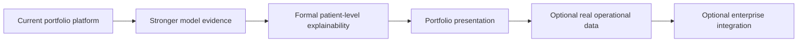

### Recommended next priorities

| Priority | Future improvement | Why it matters |
|---|---|---|
| 1 | Patient-group validation and probability calibration | Produces a more trustworthy evaluation of the public 30-day readmission model |
| 2 | Formal SHAP explanations | Shows which features push an individual patient's prediction higher or lower |
| 3 | Screenshots, demonstration video, and GitHub Pages landing page | Makes the project easier for recruiters and reviewers to understand quickly |
| 4 | JSON backup, export, restore, and retention tools | Strengthens the persistent single-instance deployment without introducing PostgreSQL |
| 5 | Stronger real discharge-flow data, when available | Improves the evidence behind the synthetic operational models |

### Model validation and analytical evidence

Planned analytical improvements include:

- split readmission training and evaluation by patient rather than individual encounter;
- add cross-validation, precision-recall AUC, and confidence intervals where appropriate;
- calibrate predicted probabilities and compare calibration curves;
- document operating thresholds for Low, Medium, High, and Critical risk;
- show confusion matrices and threshold trade-offs;
- evaluate relevant subgroups and document fairness limitations;
- review every model input for target leakage and post-outcome information;
- add data-quality and prediction-drift monitoring.

The synthetic discharge-delay classifier and delay-hours regressor will continue to be described as workflow-demonstration models unless stronger operational data becomes available.

### Formal patient-level explainability

The current interface combines native XGBoost importance with active patient signals. A future SHAP implementation would add:

- positive and negative feature contributions for each prediction;
- baseline risk versus final patient-specific risk;
- waterfall or force-style visual explanations;
- separate explanations for delay risk, expected delay hours, and readmission risk;
- explanation snapshots stored with human-review audit records.

### Persistent JSON operations

PostgreSQL is intentionally deferred. The application will remain JSON-backed for the portfolio version, with one running replica and a persistent Railway volume.

Future JSON-storage improvements may include:

- administrator backup and restore commands;
- downloadable encrypted archive exports;
- retention and rotation rules for access logs and simulation history;
- schema-version metadata for each runtime JSON store;
- startup validation and automatic repair of safe, recoverable file issues;
- clearer warnings when `BEDFLOW_DATA_DIR` is not mounted persistently;
- concurrency guards to prevent overlapping writes within the single app instance.

### Portfolio presentation

Planned presentation work includes:

- screenshots of the bed board, discharge queue, checklist, model explanations, agent review, human decision, simulator, FHIR export, and system operations tabs;
- a three-to-five-minute demonstration video;
- a GitHub Pages landing page with live-demo and repository links;
- static architecture images as a fallback when Mermaid is unavailable;
- a concise recruiter-facing project summary;
- example API requests and a downloadable sample FHIR bundle.

### Optional data strengthening

The public diabetes readmission dataset remains the strongest real-data analytical component. Future work may replace or supplement the synthetic discharge-flow dataset only if a credible public source includes fields such as:

- discharge blockers and delayed discharge outcomes;
- placement or post-acute-care availability;
- insurance authorization;
- transport readiness;
- pharmacy and medication-reconciliation readiness;
- hospital occupancy or bed-turnover activity.

### Optional enterprise integration

These items are outside the current portfolio scope but would be relevant for a genuine hospital deployment:

- enterprise SSO or OIDC, managed sessions, and MFA;
- centralized secret management, encrypted storage, and formal access reviews;
- SMART on FHIR authorization and validated terminology bindings;
- live admission-discharge-transfer and electronic health record connectivity;
- centralized monitoring, alerting, backup, and disaster recovery;
- clinical validation, model governance, and hospital-approved escalation policies.


---

## Known limitations

- The unit bed board is simulated rather than connected to a live admission-discharge-transfer feed.
- Operational delay models use synthetic and proxy data.
- The readmission model uses a diabetes-focused public dataset as a proxy for a broader discharge population.
- Capacity-simulator results are counterfactual associations, not causal forecasts or guaranteed bed recovery.
- Persistent JSON storage supports restart-safe single-instance demos, but it is not suitable for multiple replicas or high-concurrency production workloads.
- In-process request metrics reset when the API restarts.
- Local signed authentication is not enterprise SSO, MFA, or hospital identity governance.
- The FHIR output is R4-shaped demonstration JSON rather than certified conformance.
- Patient explanations use native feature importance rather than formal SHAP.
- Optional language-model output may vary and always requires human review.
- Model scores must never be interpreted as a discharge order.

---

## Safety statement

BedFlow AI is designed to answer:

> **Which cases should an authorized hospital team review first, what is blocking progress, and which operational action may help?**

It is not designed to answer:

> **Should this patient be discharged automatically?**

Final discharge readiness remains the responsibility of authorized clinical staff using the complete patient record, local policy, and direct clinical judgment.

---

<p align="center">
  <strong>BedFlow AI demonstrates how analytics become operational workflow: prediction → explanation → ownership → supervised action → audit → capacity planning.</strong>
</p>

